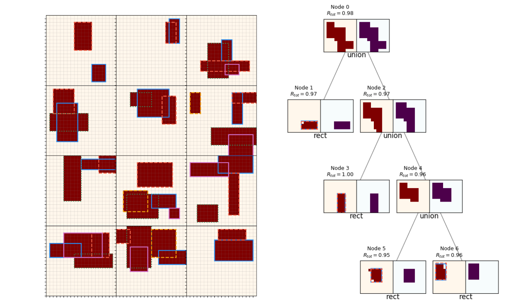

# Top-down program synthesis with a REPL and reinforcement learning

  

This is the repo for a project I did combining top-down program synthesis with reinforcement learning. <a href="https://www.declanoller.com/2020/03/03/top-down-program-synthesis-with-a-repl-and-reinforcement-learning/">The full blog post can be read here.</a>
